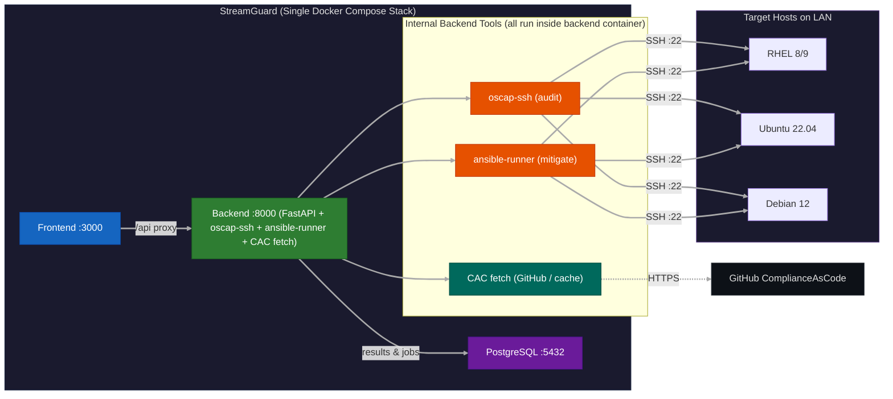

# StreamGuard

 <!-- Placeholder: Add a logo if created, e.g., via AI generator -->

**StreamGuard** is an open-source web-based frontend for the ComplianceAsCode (CAC) GitHub project, designed as a free alternative to commercial tools like Tenable. It focuses on STIG (Security Technical Implementation Guide) compliance for Linux distributions, enabling users in DevSecOps and Cybersecurity to audit, mitigate, and harden systems efficiently. Key highlights include live fetching of CAC content, automated ISO building for hardened installs, multi-host scanning and remediation via Ansible, customizable reports with charts/graphs/tables, and support for custom STIG profiles.

StreamGuard streamlines compliance workflows by treating security as a "stream" of continuous, automated processes—browsing profiles live from GitHub, scanning fleets in parallel, and applying fixes with minimal manual intervention. Built for simplicity, security, and scalability, it's ideal for enterprises, government agencies, or individual security practitioners handling DISA STIG requirements.

## Table of Contents
- [Features](#features)
- [Supported Distributions](#supported-distributions)
- [Architecture Overview](#architecture-overview)
- [Tech Stack](#tech-stack)
- [Project Structure](#project-structure)
- [Installation](#installation)
  - [Prerequisites](#prerequisites)
  - [Quick Start with Docker](#quick-start-with-docker)
  - [Manual Setup](#manual-setup)
- [Configuration](#configuration)
  - [Environment Variables](#environment-variables)
  - [SSH Key Setup for Hosts](#ssh-key-setup-for-hosts)
  - [Offline Mode and CAC Caching](#offline-mode-and-cac-caching)
- [Usage](#usage)
  - [Dashboard Overview](#dashboard-overview)
  - [Auditing Hosts](#auditing-hosts)
  - [Mitigating Hosts](#mitigating-hosts)
  - [Building STIG ISOs](#building-stig-isos)
  - [Custom Profiles](#custom-profiles)
  - [Reports and Visualizations](#reports-and-visualizations)
- [API Endpoints](#api-endpoints)
- [Security Considerations](#security-considerations)
- [Troubleshooting](#troubleshooting)
- [Contributing](#contributing)
- [Roadmap](#roadmap)
- [License](#license)
- [Acknowledgments](#acknowledgments)

## Features
StreamGuard provides a comprehensive suite of tools for STIG compliance:

- **Live CAC Integration**: Profiles are listed live from the ComplianceAsCode GitHub repo; artifacts (datastream XML/playbooks) are auto-downloaded on Run.
- **Offline Mode**: Toggle to download and cache STIG rules/Ansible content locally for supported distros, ensuring availability without internet.
- **Multi-Host Auditing**: Scan multiple hosts simultaneously using OpenSCAP against the latest or custom STIG profiles. Generates OSCAP XML artifacts plus user-friendly HTML reports with sorting, filtering, and export options (inspired by Ubuntu USG reports).
- **Multi-Host Mitigation**: Automate remediation on fleets of hosts via Ansible playbooks fetched from CAC. Supports dry-run previews and real-time progress logging.
- **STIG ISO Builder**: Generate hardened ISO images for clean installs. Users can upload their own base ISO or auto-fetch public ones (e.g., for Fedora/Ubuntu). Embeds kickstart/preseed scripts with STIG hardening.
- **Custom Profiles**: Edit CAC STIG rules (e.g., modify variables, exclude rules), create/save custom XCCDF profiles, and use them for audits/mitigations.
- **DevSecOps Visualizations**: Interactive dashboard with compliance score gauges, severity pies/bars (CAT I/II/III), top failing rules tables with sparklines, timeline charts for compliance trends, and a host matrix view.
- **Real-Time Feedback**: WebSocket-based streaming for scan/mitigation logs and progress bars.
- **Security-Focused Access**: Host interactions via passwordless SSH keys only—no passwords stored or transmitted. Hosts are auto-discovered from `~/.ssh/config` and `known_hosts` on startup.
- **Export Options**: Reports downloadable as HTML, PDF, CSV, or JSON.

## Supported Distributions
In Online mode, StreamGuard lists all products currently supported by ComplianceAsCode.
Offline mode works best with the core Linux distros (RHEL, Ubuntu, Debian, Fedora),
but any CAC product can be fetched as long as the release ZIP contains its datastream.

## Architecture Overview
StreamGuard follows a full-stack architecture:
- **Frontend**: User interface for dashboards, forms, and visualizations. Communicates with backend via REST API and WebSockets.
- **Backend**: Handles business logic, CAC fetching/caching, OpenSCAP scans, Ansible orchestration, ISO generation, and database interactions.
- **Database**: Stores cached CAC content, custom profiles, scan results, and user preferences.
- **External Integrations**:
  - ComplianceAsCode GitHub (live/raw fetches via requests/GitPython).
  - OpenSCAP for audits (via oscap-ssh CLI subprocess).
  - Ansible for mitigations (via ansible-runner for programmatic execution).
  - ISO Tools (genisoimage/xorriso for building).
- **Deployment**: Containerized with Docker Compose for easy setup; scalable to Kubernetes for production.
- **Data Flow**: User → Frontend → API → Backend Processing (fetch CAC → Scan/Mitigate → Store Results) → Render Reports/Charts.



## Tech Stack
- **Backend**: Python 3.11+ with FastAPI, Pydantic, SQLModel, GitPython, Requests, ansible-runner, oscap-ssh (subprocess).
- **Frontend**: React 18+ with TypeScript, Vite (build tool), MUI X (DataGrid, Charts), TanStack Table (advanced tables), Recharts/ApexCharts (visualizations), Axios (API calls), Monaco Editor (for profile editing).
- **Database**: PostgreSQL (production) / SQLite (development).
- **Orchestration**: Ansible for remediation; subprocess for OpenSCAP and ISO tools.
- **Deployment**: Docker Compose; Nginx as reverse proxy in production.
- **Other Tools**: WebSockets (built-in FastAPI support), asyncio (for parallel host ops), XML/JSON parsing for STIG handling.

## Project Structure
```
StreamGuard/
├── backend/                  # FastAPI server and logic
│   ├── main.py               # App entrypoint, mounts routers
│   ├── core/config.py        # Pydantic settings (env vars)
│   ├── db.py                 # SQLModel engine & session helpers
│   ├── models/               # SQLModel DB models (Host, AuditJob, Profile, …)
│   ├── schemas/              # Pydantic request/response schemas
│   ├── routers/              # FastAPI route modules (audit, cac, hosts, …)
│   ├── services/             # CAC fetch, audit, mitigate, ISO, SSH discovery
│   ├── alembic/              # DB migrations
│   ├── tests/                # Pytest test suite
│   └── cac_cache/            # Local CAC storage for offline mode (gitignored)
├── frontend/                 # React app
│   ├── src/
│   │   ├── components/       # Reusable UI (DataGrid, ComplianceGauge, Charts, …)
│   │   ├── pages/            # Dashboard, Audit, Mitigate, ISOBuilder, ProfileEditor
│   │   ├── api/              # Axios client and endpoint wrappers
│   │   └── hooks/            # Custom hooks (e.g., useWebSocket)
│   ├── vite.config.ts        # Vite setup with API proxy
│   └── package.json          # Deps (mui/x-data-grid, recharts, etc.)
├── docs/                     # Docusaurus user guide
├── .github/                  # CI workflows, issue/PR templates, Dependabot
├── docker-compose.yml        # Multi-container setup
├── Dockerfile.backend        # Backend container
├── Dockerfile.frontend       # Frontend container
├── .env.example              # Sample env vars
├── requirements.txt          # Backend Python deps
├── pyproject.toml            # Ruff linter configuration
├── alembic.ini               # Alembic migration config
├── README.md                 # This file
├── LICENSE                   # GPL-3.0
├── SECURITY.md               # Security policy
├── CONTRIBUTING.md            # Contribution guidelines
└── CODE_OF_CONDUCT.md         # Code of conduct
```

## Installation

### Prerequisites
- Python 3.11+
- Node.js 20+
- Docker (for containerized setup)
- System deps: openscap-utils, ansible, genisoimage/xorriso (install via package manager, e.g., `apt install` or `yum install`)
- Git
- SSH keys for target hosts (see Configuration)

### Quick Start with Docker
1. Clone the repo: `git clone https://github.com/darkiris4/StreamGuard.git && cd StreamGuard`
2. Copy `.env.example` to `.env` and fill in vars (e.g., `DATABASE_URL_SYNC`).
3. Mount your SSH directory into the backend container (e.g., `~/.ssh:/app/ssh:ro`).
4. Run: `docker-compose up -d` (migrations auto-apply on start).
5. Access at `http://localhost:3000` (frontend), `http://localhost:8000/docs` (API docs via Swagger), and `http://localhost:3000/docs` (user guide).

### Docs
Run the user guide locally:
```bash
cd docs
npm start
```
Preview at `http://localhost:3000/docs`.

### Manual Setup
1. **Backend**:
   - `cd backend`
   - `pip install -r requirements.txt`
   - `uvicorn main:app --reload`
2. **Frontend**:
   - `cd frontend`
   - `npm install`
   - `npm run dev`
3. Set up PostgreSQL: Create DB and update `DATABASE_URL_SYNC` in env.
4. For dev DB: Use SQLite by setting `DATABASE_URL_SYNC=sqlite:///streamguard.db`

## Configuration

### Environment Variables
Copy `.env.example` and customize:
- `DATABASE_URL_SYNC=postgresql://user:pass@db/streamguard` (or `sqlite:///streamguard.db` for dev)
- `DATABASE_URL=postgresql+asyncpg://user:pass@db/streamguard` (async variant)
- `OFFLINE_MODE=false` (toggle to true for local git clone)
- `SSH_KEY_PATH=/app/ssh/id_ed25519` (path inside container; auto-detected if present)
- `SSH_USER=root` (default SSH username for host connections)
- `CAC_RELEASE_VERSION=latest` (pin to a specific version if desired)
- `CORS_ORIGINS=http://localhost:5173,http://localhost:3000`

Optional (set in `.env` but not in `.env.example`):
- `GITHUB_TOKEN=` (raises GitHub API rate limit to 5000/hr)
- `ANSIBLE_INVENTORY=/path/to/hosts.ini` (default: dynamic)

### SSH Key Setup for Hosts
- Generate SSH key: `ssh-keygen -t ed25519`
- Add public key to target hosts' `~/.ssh/authorized_keys`
- Add hosts to `~/.ssh/config` on the StreamGuard server. The Hosts page is populated from this file.

### Offline Mode and CAC Caching
- Toggle in dashboard or via API param.
- On first use, app clones CAC repo to `cac_cache/` and extracts STIGs/Ansible for supported distros.
- Cache refreshes on demand.

## Usage

### Dashboard Overview
- Toggle live/offline mode.
- Select distro from dropdown.
- View fleet compliance summary: Gauge for overall score, pie for severities, timeline chart for trends.

### Auditing Hosts
1. Go to Audit page.
2. Select hosts from the dropdown (auto-discovered from `~/.ssh/config` and `known_hosts`).
3. Select distro and profile (profiles are listed live from GitHub in Online mode).
4. Trigger: Runs parallel scans (artifacts auto-download on Run if missing).
5. View report: Sortable DataGrid (columns: Rule ID, Severity, Status, Description, Fix). Filter by CAT level. Export XML/HTML.

### Mitigating Hosts
Similar to audit:
1. Select failed rules from report.
2. Preview Ansible fixes (dry-run).
3. Confirm and apply: Progress bars via WebSockets.

### Building STIG ISOs
1. ISO Builder page.
2. Select distro.
3. Upload base ISO or auto-fetch.
4. Generate: Embeds hardening scripts. Download result.

### Custom Profiles
1. Profile Editor page.
2. Load base STIG XML.
3. Edit rules via Monaco (JSON/XML mode).
4. Save and use in audits/mitigations.

### Reports and Visualizations
- Compliance donut chart.
- Severity bar/pie.
- Top 10 fails table with sparklines.
- Host matrix: Grid view of compliance per host.
- Dark mode default for cyber users.

## API Endpoints
See `/docs` for Swagger UI. Key ones:
- `GET /api/cac/distros`: Live list of CAC products (Online mode).
- `GET /api/cac/profiles/{distro}`: Live profile list (Online mode).
- `POST /api/audit`: `{hosts: [], distro, profile_name, profile_path}` → results.
- `POST /api/mitigate`: Similar, with `dry_run`.
- `POST /api/build_iso/{distro}`: `{base_iso_path | base_iso_url}`.

Example curl calls:
```
curl -X GET "http://localhost:8000/api/cac/distros"
curl -X GET "http://localhost:8000/api/cac/profiles/rhel9"
curl -X POST "http://localhost:8000/api/audit" -H "Content-Type: application/json" \
  -d '{"hosts":["localhost"],"distro":"rhel9","profile_name":"xccdf_org.ssgproject.content_profile_stig","profile_path":""}'
```

## Security Considerations
- No password storage—SSH keys only.
- Input validation to prevent injection.
- Rate limiting on API.
- Run as non-root in Docker.
- Audit logs for actions.
- Note: For production, add HTTPS, auth (JWT/OAuth), and vulnerability scanning (e.g., Trivy).

## Troubleshooting
- CAC fetch fails: Check internet/offline toggle.
- Ansible errors: Verify SSH keys and host reachability.
- ISO build: Ensure genisoimage installed; check legal for RHEL (requires subscription ISO).
- DB issues: Migrate with `alembic` if using SQLModel.
- Logs: Check Docker or uvicorn output.

## Contributing
We welcome contributions! See [CONTRIBUTING.md](CONTRIBUTING.md) for details. Fork, create branch, PR.
- Issues: Use GitHub for bugs/features.
- Code Style: Ruff for Python linting, Prettier for JS/TS.
- Tests: Pytest (backend)—aim for 80% coverage.

## Roadmap
- v1.0: Core features as described.
- v1.1: Cloud integration (AWS/GCP for hosted ISOs).
- v1.2: Scheduled audits, PDF exports.
- Future: Windows support, integration with Ansible Tower/AWX, mobile-responsive UI.

## License
GPL-3.0 License. See [LICENSE](LICENSE) for details.

## Acknowledgments
- Built with inspiration from ComplianceAsCode, OpenSCAP, and Ansible communities.
- Thanks to xAI/Grok for initial planning assistance.
- Special shoutout to Mike for the vision—projects like StreamSync paved the way!

If you find StreamGuard useful, star the repo or contribute! Questions? Open an issue.