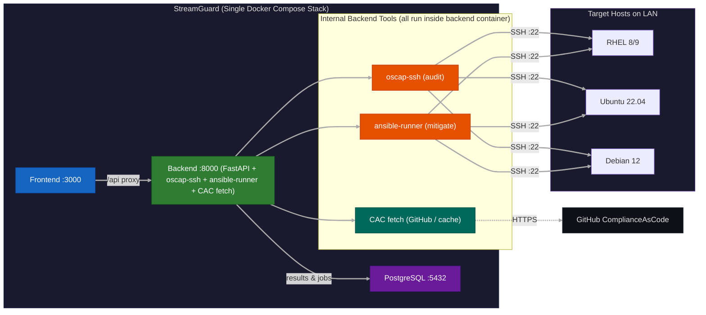

# StreamGuard User Guide

StreamGuard is an open-source STIG compliance platform that runs as a centralized Docker Compose stack. From a single server it can reach out to any host on your network — audit them against DISA STIG baselines using OpenSCAP, then remediate failures with Ansible playbooks sourced directly from the ComplianceAsCode project.

## How It Works



## Key Capabilities

- **Live CAC integration** — fetches ComplianceAsCode release ZIPs on demand from GitHub, or works fully offline with a local git clone.
- **Multi-host auditing** — runs OpenSCAP XCCDF scans in parallel across your fleet over SSH.
- **Automated remediation** — applies Ansible playbooks from ComplianceAsCode with dry-run support.
- **SSH host discovery** — auto-discovers hosts from your `~/.ssh/known_hosts` on startup.
- **Dashboard & reporting** — compliance gauges, severity breakdowns, trend timelines, and CSV/JSON export.
- **Hardened ISOs** — generates kickstart/preseed ISOs for clean STIG-compliant installs.
- **Custom profiles** — tailor STIG enforcement with the built-in Monaco editor.

## Prerequisites

- **Docker Engine + Docker Compose** on the central server.
- **SSH key-based access** to every target host you want to audit or mitigate. The server's `~/.ssh/` directory is mounted into the backend container.
- **Basic familiarity** with STIG severity levels (CAT I / II / III), OpenSCAP, and Ansible.

## Quick Start

```bash
git clone <repo-url> StreamGuard && cd StreamGuard
cp .env.example .env          # edit if needed
docker compose up -d
```

Then open the UI at `http://<server-ip>:3000`. Hosts from your SSH `known_hosts` are loaded automatically — go to **Audit**, pick a distro and profile, and click **Run**.

See the [Setup](./setup.md) page for detailed configuration.
